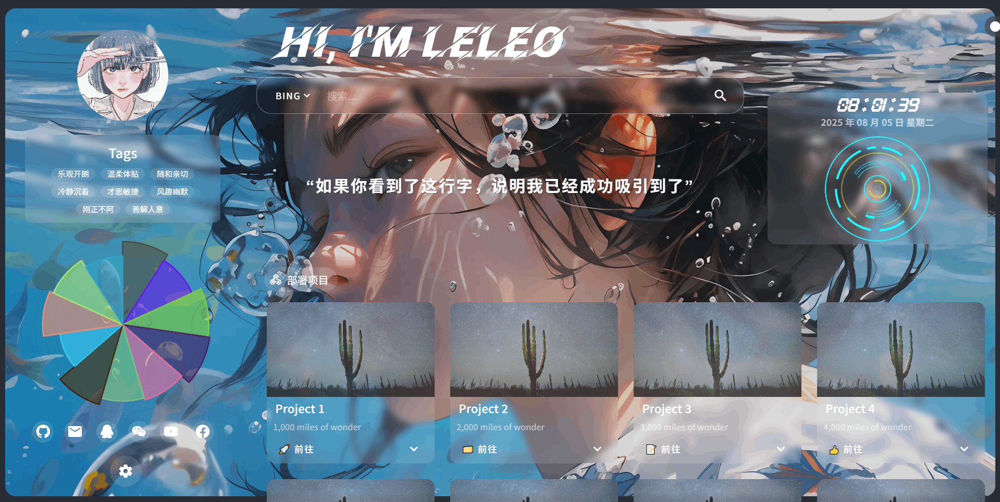
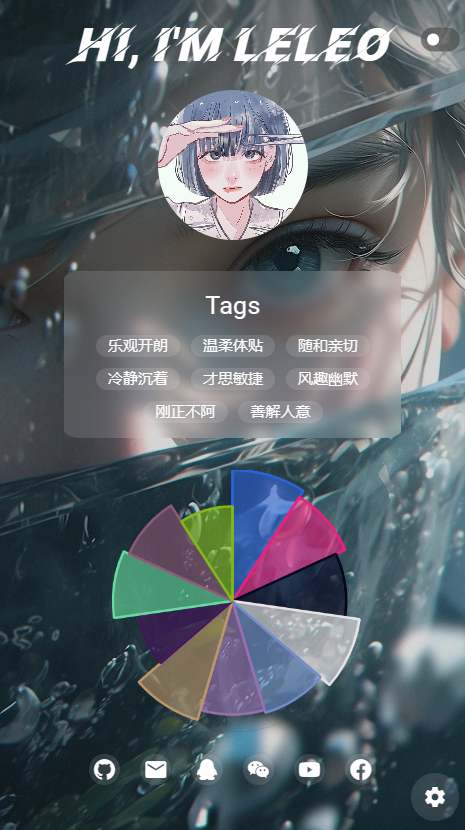
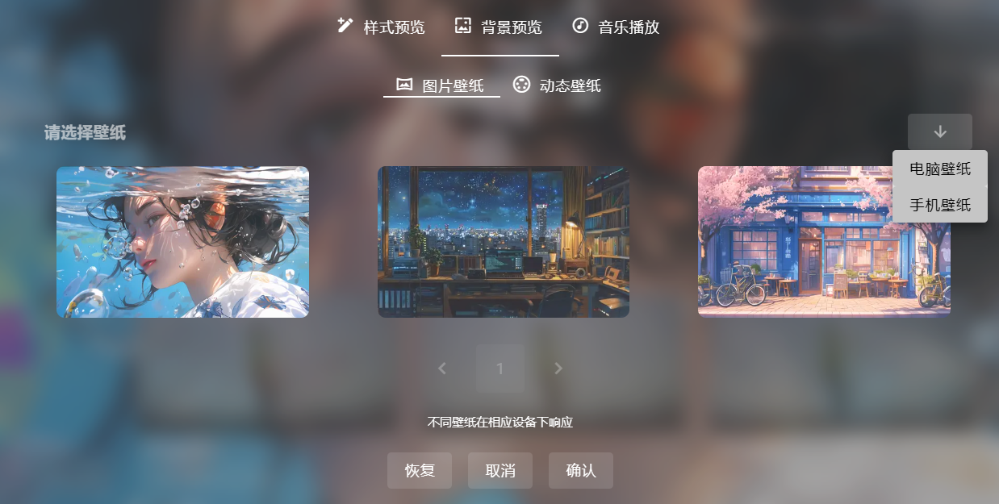
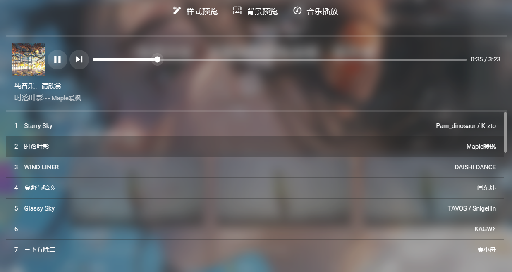

# 🌐 Leleo 个人主页

一个精美的响应式个人主页，基于 Vue 3 + Vite + Vuetify 构建。支持壁纸切换、音乐播放、技能雷达图、项目卡片、打字机效果等功能。

> 🖥️ **在线演示**：[https://duyue-d4gw2qp01d8a7bd6e-1433783466.tcloudbaseapp.com](https://duyue-d4gw2qp01d8a7bd6e-1433783466.tcloudbaseapp.com)

---

## 📋 目录

- [效果预览](#效果预览)
- [快速开始（从零到上线）](#快速开始从零到上线)
- [本地运行](#本地运行)
- [配置详解](#配置详解)
- [部署到 CloudBase（腾讯云免费）](#部署到-cloudbase腾讯云免费)
- [部署到其他平台](#部署到其他平台)
- [日常修改流程](#日常修改流程)
- [项目结构](#项目结构)
- [技术栈](#技术栈)

---

## 效果预览

| 桌面端 | 移动端 |
|--------|--------|
|  |  |




---

## 快速开始（从零到上线）

想搞一个一模一样的网站，跟着下面步骤走：

### 第 0 步：准备工作

你需要提前准备好：

| 准备事项 | 说明 |
|----------|------|
| **Node.js** | 去 [nodejs.org](https://nodejs.org) 下载安装，选 LTS 版本 |
| **GitHub 账号** | 用来存放代码 |
| **腾讯云账号** | 用来部署网站（微信扫码注册就行，免费） |
| **一个终端** | Windows 用 PowerShell 或 CMD，Mac 用终端 |

---

### 第 1 步：克隆代码

```bash
git clone https://github.com/duyue520/yue-web.git
cd yue-web
```

---

### 第 2 步：安装依赖

```bash
npm install
```

这一步会下载 Vue、Vite、Vuetify 等所有需要的包，大概需要 1-2 分钟。

---

### 第 3 步：本地预览

```bash
npm run dev
```

浏览器打开 `http://localhost:5173`，你应该能看到和演示一模一样的网站了。

---

### 第 4 步：改成你自己的内容

打开 `src/config.js`，把里面的名字、头像、技能、链接等改成你自己的。详见下方 [配置详解](#配置详解)。

---

### 第 5 步：构建

```bash
npm run build
```

构建成功后，所有静态文件都在 `dist/` 目录下。

---

### 第 6 步：部署到 CloudBase

详见下方 [部署到 CloudBase](#部署到-cloudbase腾讯云免费)，大约 5 分钟搞定。

> 部署完你就拥有了自己的网址：`https://你的环境ID.tcloudbaseapp.com`

---

## 本地运行

```bash
# 1. 安装依赖
npm install

# 2. 启动开发服务器
# 改代码浏览器自动刷新，非常方便调试
npm run dev

# 3. 构建生产版本
npm run build

# 4. 预览构建结果（和部署后效果一致）
npm run preview
```

构建后的文件在 `dist/` 目录下，整个目录就是你要部署到服务器的东西。

---

## 配置详解

> ⭐ **改这一个文件就能定制整个网站**：`src/config.js`

下面逐项说明每个配置字段：

---

### 1. 网页标题和描述 `metaData`

```js
metaData: {
  title: '越的网站🎉',          // 浏览器标签页显示的标题
  description: '欢迎来到Leleo的奇妙世界！',  // SEO 描述
  keywords: 'Leleo,个人主页',     // SEO 关键词
  icon: '/favicon.ico'           // 网页图标（小图）
},
```

---

### 2. 头像和欢迎语

```js
avatar: "/img/avatar.jpg",        // 头像图片，把图片放 public/img/ 下
welcometitle: "嗨，我是越",        // 欢迎标题，显示在头像上方
```

> 换头像：把新图片放到 `public/img/` 目录，然后改这个路径。

---

### 3. 颜色主题

```js
color: {
  themecolor: "#FFFFFF",           // 主题颜色（卡片、按钮等）
  welcometitlecolor: "#FFFFFF",    // 欢迎标题颜色
  turntablecolor1: "#FFFF00",     // 唱片转盘渐变起始色
  turntablecolor2: "#00FFFF"      // 唱片转盘渐变结束色
},
```

---

### 4. 背景效果

```js
brightness: 85,   // 背景亮度，0-100，越小越暗
blur: 5,          // 毛玻璃模糊程度，越大越模糊
```

---

### 5. 个性标签 `tags`

```js
tags: ['乐观开朗', '温柔体贴', '随和亲切', '冷静沉着', '才思敏捷'],
```

改成语你量身定制的标签，想加几个加几个。

---

### 6. 默认背景壁纸 `background`

控制网站打开时显示的默认壁纸：

```js
background: {
  "pc": {
    "type": "pic",                // "pic" = 静态壁纸 / "video" = 动态壁纸
    "datainfo": {
      "title": "海洋女孩",        // 壁纸名字
      "preview": "/img/wallpaper/static/海洋女孩/image-pre.webp",  // 预览图
      "url": "/img/wallpaper/static/海洋女孩/image.png"             // 实际壁纸
    },
  },
  "mobile": {
    "type": "pic",
    "datainfo": {
      "title": "0001",
      "preview": "/img/wallpaper/static-mobile/0001/image-pre.webp",
      "url": "/img/wallpaper/static-mobile/0001/image.png"
    }
  }
},
```

> 壁纸也可以用网络链接，比如随机壁纸 API：`"url": "https://t.mwm.moe/pc"`

---

### 7. 技能雷达图 `polarChart`

```js
polarChart: {
  skills: ['Vue.js', 'React', 'JavaScript', 'Node', 'Java', 'Python', 'linux', 'Docker', 'MySQL', 'MongoDB', 'AWS'],
  skillPoints: [85, 78, 88, 90, 80, 78, 85, 65, 82, 78, 70],
},
```

- `skills`：技能名称列表
- `skillPoints`：对应的能力值（0-100），和上面一一对应

---

### 8. 社交按钮 `socialPlatformIcons`

```js
socialPlatformIcons: [
  { icon: "mdi-github", link: "https://www.github.com/你的用户名" },
  { icon: "mdi-email", link: "mailto:你的邮箱@foxmail.com" },
  { icon: "mdi-qqchat", link: "https://im.qq.com/" },
  { icon: "mdi-wechat", link: "https://wx.qq.com/" },
  { icon: "mdi-youtube", link: "https://www.youtube.com" },
  { icon: "mdi-facebook", link: "https://www.facebook.com" }
],
```

图标名称用的是 MDI 图标库，可以在 [pictogrammers.com](https://pictogrammers.com/library/mdi/) 搜索图标名。

---

### 9. 打字机文字 `typeWriterStrings`

```js
typeWriterStrings: [
  "如果你看到了这行字，说明我已经成功吸引到了你的注意力。",
  "心简单，世界就简单，幸福才会生长。",
  "生命太短，没有时间留给遗憾，若不是终点，请微笑一直向前。"
],
```

首页会逐条轮播这些文字，打字机动画效果。

---

### 10. 音乐播放器 `musicPlayer`

```js
musicPlayer: {
  server: 'netease',     // 网易云音乐
  type: 'playlist',      // playlist = 歌单 / song = 单曲
  id: '2028178887'       // 歌单ID（从网易云歌单链接里找）
},
```

> 怎么找歌单 ID？打开网易云歌单，地址栏里 `music.163.com/#/playlist?id=2028178887`，`id=` 后面那串数字就是。换成你自己的歌单 ID。

---

### 11. 可选壁纸列表 `wallpaper`

用户在设置面板里可以切换的壁纸：

```js
wallpaper: {
  // PC 端静态壁纸
  pic: [
    { "title": "海洋女孩", "preview": "/img/wallpaper/static/海洋女孩/image-pre.webp", "url": "/img/wallpaper/static/海洋女孩/image.png" },
    // 也可以用网络图片：
    { "title": "网络壁纸", "preview": "https://xxx.jpg", "url": "https://xxx.jpg" },
  ],
  // 移动端静态壁纸
  picMobile: [
    { "title": "0001", "preview": "/img/wallpaper/static-mobile/0001/image-pre.webp", "url": "/img/wallpaper/static-mobile/0001/image.png" },
  ],
  // PC 端动态壁纸（webm 格式视频）
  video: [
    { "title": "向往航天的女孩", "preview": "/img/wallpaper/dynamic/xxx-pre.webm", "url": "/img/wallpaper/dynamic/xxx.webm" },
  ],
  // 移动端动态壁纸（mp4 格式视频）
  videoMobile: [
    { "title": "小猫女仆", "preview": "/img/wallpaper/dynamic-mobile/xxx-pre.mp4", "url": "/img/wallpaper/dynamic-mobile/xxx.mp4" },
  ],
},
```

**添加新壁纸的步骤：**
1. 把图片/视频文件放到 `public/img/wallpaper/` 对应目录下
2. 同时在 `public/img/wallpaper/` 放一个同名的缩略图（`-pre.webp` 或 `-pre.webm`）
3. 在 `config.js` 的 `wallpaper` 对应数组里加一条

---

### 12. 项目卡片 `projectcards`

```js
projectcards: [
  {
    go: "⏰ 体验",                   // 按钮文字
    img: "/img/1.jpg",              // 卡片图片
    title: "自律打卡",               // 项目名
    subtitle: "每日自律打卡计时",    // 副标题
    text: "环形计时器记录专注时长",   // 描述
    url: "/romance/love1.html",     // 链接（可以是外链）
    show: false                     // 描述文字是否默认展开
  },
],
```

---

### 13. 备案号和版权

```js
statement: ["备案号：XXICP备123456789号", "Copyright © 2025 Leleo"],
```

---

## 部署到 CloudBase（腾讯云免费）

> 💰 **免费额度**：5GB 流量/月 + 2GB 存储，**长期免费**。个人主页这点访问量，根本用不完。

### 为什么选 CloudBase？

| 优点 | 说明 |
|------|------|
| 🆓 免费 | 个人主页永远不用花钱 |
| 🇨🇳 国内访问快 | 自带 CDN 加速 |
| 🔒 HTTPS | 免费 SSL 证书，自动续期 |
| ⚡ 部署快 | 一条命令就上线 |

---

### 第一步：注册腾讯云

1. 浏览器打开 [cloud.tencent.com](https://cloud.tencent.com)
2. 点击右上角"免费注册"
3. 微信扫码 → 同意协议 → 注册成功

> 已有账号的话跳过这步。

---

### 第二步：开通 CloudBase

1. 打开 [CloudBase 控制台](https://console.cloud.tencent.com/tcb)
2. 点击 **新建环境**
3. 配置如下：

| 配置项 | 填什么 |
|--------|--------|
| 环境名称 | 随便写，比如 `my-homepage` |
| 计费方式 | **按量计费**（重要！免费额度内不扣费） |
| 区域 | 选离你近的 |

4. 点击"立即开通"，等 1-2 分钟环境创建完成

---

### 第三步：安装部署工具

打开终端，执行：

```bash
npm install -g @cloudbase/cli
```

安装完验证一下：

```bash
tcb --version
```

---

### 第四步：登录

```bash
tcb login
```

浏览器会自动弹出腾讯云登录页，微信扫码授权。

---

### 第五步：查看环境 ID

```bash
tcb env:list
```

会显示类似：

```
┌─────────────────────────┬───────────┬───────────┐
│     Environment ID      │  Package  │  Status   │
├─────────────────────────┼───────────┼───────────┤
│ duyue-d4gw2qp01d8a7bd6e │   体验版   │  Normal   │
└─────────────────────────┴───────────┴───────────┘
```

记下第一列的 **Environment ID**，后面要用。

---

### 第六步：构建 + 部署

```bash
# 在项目目录下执行

# 构建
npm run build

# 部署（把下面"你的环境ID"换成第五步记下的那个）
tcb hosting deploy dist/ -e 你的环境ID
```

等大约 10-30 秒，上传完成会显示：

```
✔ Deployment complete => https://你的环境ID.tcloudbaseapp.com
✔ Total files: 68
✔ Successfully uploaded 68 file(s)
```

🎉 **你的网站上线了！** 打开那个链接就能看到。

---

### 第七步：配置路由（必须做！）

如果不配置，用户刷新页面会 404。操作如下：

1. 打开 [CloudBase 控制台](https://console.cloud.tencent.com/tcb)
2. 点击你的环境 → **静态网站托管** → **路由配置**
3. 点击"添加规则"：

| 字段 | 值 |
|------|-----|
| 来源 URL | `/*` |
| 目标 URL | `/index.html` |
| 状态码 | `200` |

4. 保存

---

### 第八步（可选）：绑定自定义域名

1. 控制台 → 静态网站托管 → **域名管理**
2. 点击"添加域名"，填入你的域名
3. 去你的域名 DNS 管理后台，添加 CNAME 记录
4. 一键开启 HTTPS

> 没有域名的话，CloudBase 给的默认域名完全够用。

---

## 部署到其他平台

<details>
<summary>🔗 Vercel（点击展开）</summary>

[点击一键部署](https://vercel.com/new/clone?s=https://github.com/leleo886/leleo-home-page.git)

⚠️ `.vercel.app` 域名在国内可能打不开，建议绑定自定义域名。DNS 添加 CNAME 记录指向 `cname.vercel-dns.com`。

</details>

<details>
<summary>☁️ CloudFlare Pages（点击展开）</summary>

1. Fork 本项目到你的 GitHub
2. 登录 CloudFlare → 左侧 **Workers 和 Pages** → **创建** → **Pages**
3. 点击"连接到 Git"，授权 GitHub，选择本仓库
4. 框架预设选择 **Vue**
5. 点击"保存并部署"

</details>

---

## 日常修改流程

以后每次想改网站内容，按这个流程：

```bash
# 1️⃣ 改代码
#    编辑 src/config.js，或者改其他你想改的文件

# 2️⃣ 重新构建
npm run build

# 3️⃣ 重新部署
tcb hosting deploy dist/ -e 你的环境ID
```

三行命令搞完，网站就更新了。

> 💡 **提示**：部署后 CDN 有缓存。如果打开网站看不到更新，用浏览器**无痕模式**打开试试，或者等 5-10 分钟 CDN 缓存过期。

### 想把修改同步回 GitHub？

```bash
git add -A
git commit -m "更新了xxx配置"
git push origin main
```

### 别人想在他们的电脑上接着改？

```bash
git clone https://github.com/duyue520/yue-web.git
cd yue-web
npm install
npm run dev        # 开始开发
```

---

## 项目结构

```
.
├── src/                          # 📁 源代码（你主要改这里）
│   ├── main.js                  # Vue 入口，挂载 Vuetify
│   ├── App.vue                  # 根组件，页面布局
│   ├── app.js                   # 核心逻辑：背景切换、音乐、设置
│   ├── config.js                # ⭐ 配置中心（改网站内容就改这个）
│   ├── components/              # Vue 组件
│   │   ├── hoemright.vue       # 主页主体：搜索、项目卡片、时钟、唱片
│   │   ├── loader.vue          # 加载动画
│   │   ├── polarchart.vue      # 技能雷达图（Chart.js）
│   │   ├── typewriter.vue      # 打字机文字动画
│   │   ├── turntable.vue       # 旋转唱片动画
│   │   └── tabs/               # 设置面板
│   │       ├── tab1.vue        # 主题风格切换
│   │       ├── tab2.vue        # 壁纸切换预览
│   │       └── tab3.vue        # 音乐播放器设置
│   └── utils/
│       ├── common.js           # 工具函数、控制台 ASCII 艺术字
│       └── cookieUtils.js      # Cookie 操作（保存用户偏好）
│
├── public/                      # 📁 静态资源（图片、字体等）
│   ├── css/                     # 样式文件
│   │   ├── style.css           # 全局样式
│   │   ├── app.less            # PC 端样式
│   │   └── mobile.less         # 移动端样式
│   ├── img/
│   │   ├── avatar.jpg          # 头像
│   │   ├── 1.jpg ~ 5.jpg       # 项目卡片图片
│   │   ├── sunshine.jpg        # 默认卡片图
│   │   ├── stackicon/          # 技术栈图标
│   │   └── wallpaper/          # 🖼️ 壁纸文件（重点！）
│   │       ├── static/         # PC 静态壁纸（png/jpg）
│   │       ├── static-mobile/  # 移动端静态壁纸
│   │       ├── dynamic/        # PC 动态壁纸（webm 视频）
│   │       └── dynamic-mobile/ # 移动端动态壁纸（mp4 视频）
│   ├── fonts/                   # 自定义字体
│   └── romance/                 # 浪漫子页面
│       ├── love1.html ~ love5.html
│       ├── heart.html           # 爱心页面
│       ├── tree.html            # 许愿树
│       └── 015/                 # 烟花特效页面
│
├── dist/                        # 📦 构建产物（npm run build 生成）
│   └── ...                      # 部署时上传整个目录到 CloudBase
│
├── img/                         # 📁 文档截图（不上传到网站）
│   ├── config.md               # 配置模板
│   ├── env.md                  # 环境变量示例
│   ├── domainToVercel.md       # Vercel 绑定域名教程
│   └── leleo-home-page/        # 网站截图
│
├── index.html                   # HTML 入口文件
├── vite.config.js               # Vite 构建配置
├── package.json                 # 项目依赖配置
├── tencent-cloud-deploy-guide.md # 腾讯云部署详细指南
└── README.md                    # 📖 你正在看的这个文件
```

---

## 技术栈

| 技术 | 版本 | 用途 |
|------|------|------|
| **Vue** | 3.x | 前端框架 |
| **Vite** | 5.x | 构建工具（开发/打包） |
| **Vuetify** | 3.x | Material Design UI 组件库 |
| **Chart.js** | 4.x | 技能雷达图图表 |
| **Typeit** | 最新 | 打字机文字动画 |
| **MetingJS** | 最新 | 网易云音乐播放器 |
| **Less** | 最新 | CSS 预处理器 |

---

## 常见问题

### Q1: `npm install` 很慢怎么办？

换成国内镜像源：

```bash
npm config set registry https://registry.npmmirror.com
```

然后再执行 `npm install`。

### Q2: 部署后刷新页面出现 404？

没有配置 CloudBase 路由规则，回头做一下 [第七步](#第七步配置路由必须做)。

### Q3: 音乐播放不了？

MetingJS API 依赖第三方服务，偶尔不稳定。可以去 [MetingJS](https://github.com/metowolf/MetingJS) 查看最新状态。

### Q4: 想用自己域名，但域名没备案？

- CloudBase 默认域名不需要备案
- 如果用自定义域名指向国内服务器，需要 ICP 备案

### Q5: 怎么更新壁纸？

1. 把新壁纸放到 `public/img/wallpaper/` 对应目录
2. 在 `src/config.js` 的 `wallpaper` 对应数组里加一条
3. `npm run build` → `tcb hosting deploy dist/ -e 你的环境ID`

---
> 📝 项目源码来自 [leleo886/leleo-home-page](https://github.com/leleo886/leleo-home-page)
